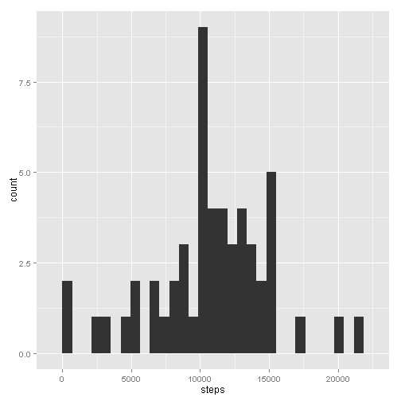
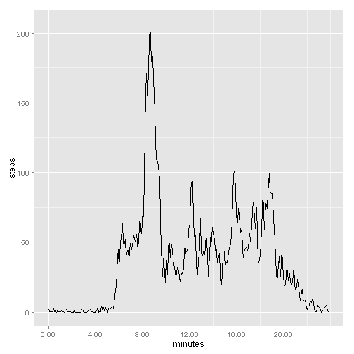
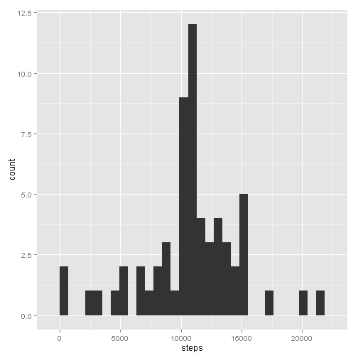
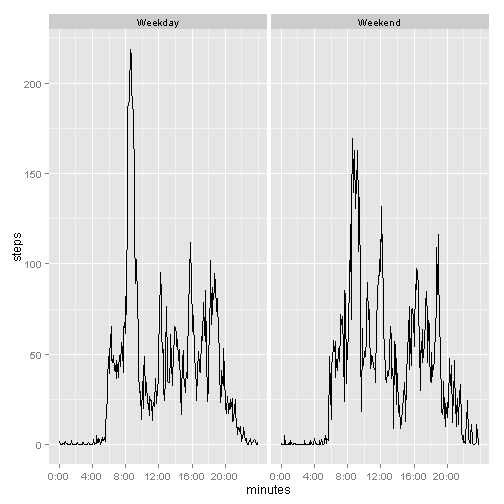

EXPLANATION OF ASSIGNMENT


```r
# LOAD AND CLEAN
step.data <- read.csv("activity/activity.csv", as.is=TRUE)
anyNA(step.data$date <- as.Date(step.data$date))
```

```
## [1] FALSE
```

```r
summary(step.data)
```

```
##      steps             date               interval     
##  Min.   :  0.00   Min.   :2012-10-01   Min.   :   0.0  
##  1st Qu.:  0.00   1st Qu.:2012-10-16   1st Qu.: 588.8  
##  Median :  0.00   Median :2012-10-31   Median :1177.5  
##  Mean   : 37.38   Mean   :2012-10-31   Mean   :1177.5  
##  3rd Qu.: 12.00   3rd Qu.:2012-11-15   3rd Qu.:1766.2  
##  Max.   :806.00   Max.   :2012-11-30   Max.   :2355.0  
##  NA's   :2304
```

First, we load the data from our working directory and clean it.  We see that the date field can be converted to Date class with no missing values and that about 13% of the $steps entries are NA.


```r
# TOTAL STEPS PER DAY
library(xtable)
```

```
## Warning: package 'xtable' was built under R version 3.1.2
```

```r
steps.per.day <- aggregate(steps ~ as.character(date), step.data, sum)
names(steps.per.day)[1] <- "date"
print(xtable(steps.per.day))
```

```
## % latex table generated in R 3.1.1 by xtable 1.7-4 package
## % Sun Feb 15 19:17:09 2015
## \begin{table}[ht]
## \centering
## \begin{tabular}{rlr}
##   \hline
##  & date & steps \\ 
##   \hline
## 1 & 2012-10-02 & 126 \\ 
##   2 & 2012-10-03 & 11352 \\ 
##   3 & 2012-10-04 & 12116 \\ 
##   4 & 2012-10-05 & 13294 \\ 
##   5 & 2012-10-06 & 15420 \\ 
##   6 & 2012-10-07 & 11015 \\ 
##   7 & 2012-10-09 & 12811 \\ 
##   8 & 2012-10-10 & 9900 \\ 
##   9 & 2012-10-11 & 10304 \\ 
##   10 & 2012-10-12 & 17382 \\ 
##   11 & 2012-10-13 & 12426 \\ 
##   12 & 2012-10-14 & 15098 \\ 
##   13 & 2012-10-15 & 10139 \\ 
##   14 & 2012-10-16 & 15084 \\ 
##   15 & 2012-10-17 & 13452 \\ 
##   16 & 2012-10-18 & 10056 \\ 
##   17 & 2012-10-19 & 11829 \\ 
##   18 & 2012-10-20 & 10395 \\ 
##   19 & 2012-10-21 & 8821 \\ 
##   20 & 2012-10-22 & 13460 \\ 
##   21 & 2012-10-23 & 8918 \\ 
##   22 & 2012-10-24 & 8355 \\ 
##   23 & 2012-10-25 & 2492 \\ 
##   24 & 2012-10-26 & 6778 \\ 
##   25 & 2012-10-27 & 10119 \\ 
##   26 & 2012-10-28 & 11458 \\ 
##   27 & 2012-10-29 & 5018 \\ 
##   28 & 2012-10-30 & 9819 \\ 
##   29 & 2012-10-31 & 15414 \\ 
##   30 & 2012-11-02 & 10600 \\ 
##   31 & 2012-11-03 & 10571 \\ 
##   32 & 2012-11-05 & 10439 \\ 
##   33 & 2012-11-06 & 8334 \\ 
##   34 & 2012-11-07 & 12883 \\ 
##   35 & 2012-11-08 & 3219 \\ 
##   36 & 2012-11-11 & 12608 \\ 
##   37 & 2012-11-12 & 10765 \\ 
##   38 & 2012-11-13 & 7336 \\ 
##   39 & 2012-11-15 &  41 \\ 
##   40 & 2012-11-16 & 5441 \\ 
##   41 & 2012-11-17 & 14339 \\ 
##   42 & 2012-11-18 & 15110 \\ 
##   43 & 2012-11-19 & 8841 \\ 
##   44 & 2012-11-20 & 4472 \\ 
##   45 & 2012-11-21 & 12787 \\ 
##   46 & 2012-11-22 & 20427 \\ 
##   47 & 2012-11-23 & 21194 \\ 
##   48 & 2012-11-24 & 14478 \\ 
##   49 & 2012-11-25 & 11834 \\ 
##   50 & 2012-11-26 & 11162 \\ 
##   51 & 2012-11-27 & 13646 \\ 
##   52 & 2012-11-28 & 10183 \\ 
##   53 & 2012-11-29 & 7047 \\ 
##    \hline
## \end{tabular}
## \end{table}
```

```r
# HISTOGRAM OF STEP COUNTS
library(ggplot2)
```

```
## Warning: package 'ggplot2' was built under R version 3.1.2
```

```r
ggplot(aes(x=steps), data=steps.per.day) + geom_bar()
```

```
## stat_bin: binwidth defaulted to range/30. Use 'binwidth = x' to adjust this.
```

 

```r
# MEAN AND MEDIAN STEPS PER DAY
# mean(steps.per.day$steps)
# median(steps.per.day$steps)
```
Aggregated by day, we see that daily steps for this respondent are typically between 10 and 12 thousand, but can be over 20 thousand.  The mean number of steps is 1.0766189 &times; 10<sup>4</sup> and the median number is an almost identical 10765.


```r
# LINE GRAPH OF AVERAGE STEPS IN EACH FIVE MINUTE BIN
steps.per.bin <- aggregate(steps ~ interval, step.data, mean)
hr <- steps.per.bin$interval %/% 100
min <- sprintf("%02d", steps.per.bin$interval %% 100)
steps.per.bin$timebin <- paste(hr, min, sep=':')
steps.per.bin$minutes <- 60 * hr + as.numeric(min)
ggplot(aes(x=minutes, y=steps), data=steps.per.bin) + geom_line() +
  scale_x_continuous(breaks=steps.per.bin[match(seq(0, 2000, 400), steps.per.bin$interval),"minutes"], 
                     labels=steps.per.bin[match(seq(0, 2000, 400), steps.per.bin$interval),"timebin"])
```

 

```r
# TIME BIN WITH HIGHEST AVERAGE
#steps.per.bin[match(max(steps.per.bin$steps), steps.per.bin$steps), ]
```
Graphing average steps by five-minute time bin shows us a huge spike around 9 AM and smaller ones around 12 PM, 4 PM and 7 PM.  The five-minute bin with the highest average is 8:35 with 206.1698113 steps on average.

There are 2304 missing step values in the data.  We will construct imputed values by using the values of nearby times on the same day and of 
very nearby times on other days.  We determine the weightings as follows:

* 3: Five minutes away from the missing time bin on the same day as the missing time bin.
* 2: Ten minutes away on the same day or zero minutes away on another day.
* 1: Fifteen minutes away on the same day or five minutes away on another day.

Values on the other side of midnight (e.g. fifteen minutes before 12:10 AM) are not counted, which should affect the final analysis very little; few steps are taken near midnight.


```r
# NUMBER OF MISSING VALUES (NA)
# sum(is.na(step.data$steps))
# IMPUTE MISSING VALUES IN NEW DATA SET
as.minutes <- 60 * (step.data$interval %/% 100) + step.data$interval %% 100
impute.func <- Vectorize(function(tgt.time, tgt.day) {
  day.weight <- -2 * as.numeric(step.data$date!=tgt.day)
  time.weight <- 4 - abs(tgt.time - as.minutes)/5
  sum(step.data$steps * 
    (pmax(0, time.weight + day.weight) * !is.na(step.data$steps)) / 
    sum((pmax(0, time.weight + day.weight) * !is.na(step.data$steps))), na.rm=T)
})

no.data <- subset(step.data, is.na(steps))
no.data$minutes <- as.minutes[is.na(step.data$steps)]
no.data$imputed.steps <- impute.func(no.data$minutes, no.data$date)
#summary(no.data$imputed.steps)
step.data.imp <- step.data
step.data.imp[is.na(step.data$steps), "steps"] <- no.data$imputed.steps

# HISTOGRAM OF STEP COUNTS w/ NEW DATA
steps.per.day.imp <- aggregate(steps ~ as.character(date), step.data.imp, sum)
names(steps.per.day.imp)[1] <- "date"
ggplot(aes(x=steps), data=steps.per.day.imp) + geom_bar()
```

```
## stat_bin: binwidth defaulted to range/30. Use 'binwidth = x' to adjust this.
```

 

```r
# MEAN AND MEDIAN STEPS PER DAY w/ NEW DATA
mean(steps.per.day.imp$steps)
```

```
## [1] 10766.16
```

```r
median(steps.per.day.imp$steps)
```

```
## [1] 10766
```

The mean and median change very little after imputation, to 1.0766164 &times; 10<sup>4</sup> and 1.0766003 &times; 10<sup>4</sup> respectively.  However, the median sort of day (in terms of total steps) is much more represented after imputation than before.  This is not surprising, as the best guess for an entire missing day is often the mean/median, and the missing data clusters quite a bit by day.


```r
# PANEL PLOT TIME BIN LINE GRAPH OF MEAN STEPS BY WEEKEND/WEEKDAY FACTOR
step.data.imp$wday <- weekdays(as.POSIXct(step.data.imp$date))
daytype.func <- Vectorize(function(x) if(x %in% c("Saturday", "Sunday")) "Weekend" else "Weekday")
step.data.imp$day.type <- as.factor(daytype.func(step.data.imp$wday))
steps.per.bin.type <- aggregate(steps ~ interval + day.type, step.data.imp, mean)
hr <- steps.per.bin.type$interval %/% 100
min <- sprintf("%02d", steps.per.bin.type$interval %% 100)
steps.per.bin.type$timebin <- paste(hr, min, sep=':')
steps.per.bin.type$minutes <- 60 * hr + as.numeric(min)
ggplot(aes(x=minutes, y=steps), data=steps.per.bin.type) + geom_line() +
  facet_grid(. ~ day.type) +
  scale_x_continuous(breaks=steps.per.bin.type[match(seq(0, 2000, 400), steps.per.bin.type$interval),"minutes"], 
                     labels=steps.per.bin.type[match(seq(0, 2000, 400), steps.per.bin.type$interval),"timebin"])
```

 

Weekdays have much bigger spikes around 9 AM (does the subject exercise before work?) and weekends have step counts more spread out.  There is a noticable difference between weekdays and weekends.
